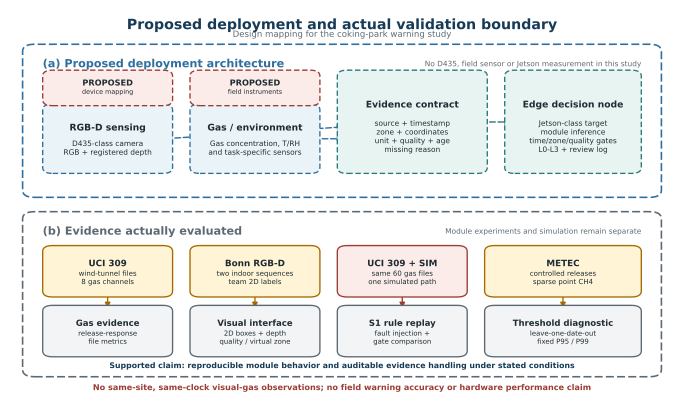

# 异源感知条件下面向焦化园区的分级预警方法研究——证据质量门控与模块化验证

> 投稿工作稿 v1，2026-09-27。作者、单位、基金编号和通信信息待项目组与指导教师确认。本稿未投稿。

## 摘要

针对焦化园区拟部署预警中气体与视觉证据来源不同、时间和区域不可直接对齐以及缺测证据易被误用的问题，提出一种带来源、时钟、区域、质量、时效和缺测原因的异源证据接口及分级处置方法。方法分别在 UCI 309 风洞气体数据、Bonn 室内 RGB-D 数据和 UCI 309 气体证据加仿真人员轨迹的 S1 场景中验证，并以 METEC 受控释放数据检查固定阈值的跨日期稳定性。UCI 309 的八通道中位规则在 60 个测试文件中有 57 个于供气后 60 s 内形成持续响应，释放前触发 1 个文件；Bonn 115 帧中匹配 62/66 个人员框，第二段 34 个有人帧中 32 个得到有效检测框深度；四类各 600 s 的故障重放中，完整门控在不满足配对条件的窗口输出联合未知且无 L3，移除相应门控后产生 550 或 553 s 的无效配对 L3；METEC 按日期留一时，训练背景 P95 固定阈值对释放活动观测秒的覆盖中位数为 18.0%，显示明显日期差异。结果表明，显式质量和时空门控可使异源证据的联合条件可审计，单点固定阈值不宜脱离日期和环境上下文直接迁移。本文验证的是公开数据局部功能和模拟规则行为，不代表焦化园区现场事故预警准确率或硬件性能。

**关键词：**焦化园区；气体传感器；RGB-D；异源感知；质量门控；分级预警；模块化验证

## 1 引言

焦化生产包含气体、人员活动和设备状态等多类安全信息。GB 12710—2024 已作为现行焦化安全规范实施，作业场所气体检测报警仪器同时受 GB 12358—2024 等适用要求约束 [@gb12710_2024; @gb12358_2024]。实际监测系统因此既要处理单路传感器的变化，也要回答不同来源的证据在什么条件下可以共同触发更高优先级处置。若直接把缺测、过期或覆盖区域不同的证据拼接，联合输出虽然形式完整，却可能缺少可验证的物理对应关系。

金属氧化物气体传感器成本较低、响应灵敏，但其输出受气体混合、温湿度、器件状态和实验程序影响。Fonollosa 等在湍流风洞和动态气室中研究了多通道响应与混合气辨识 [@fonollosa2014chemical; @fonollosa2015reservoir]。后续研究表明，温湿度变化会造成明显响应漂移并需要针对具体传感器校正 [@abdullah2022correction]；公开气敏数据若在采集时间上成批聚集，还可能因漂移与时间相关性产生过高的分类估计 [@dennler2022drift]。这些结果说明，离线气体实验应按完整试验或日期分组，明确校准条件，并把传感器响应分数与实际浓度、气种和事故状态区分开。

RGB-D 感知可同时提供外观与深度线索。DepthTrack 等研究显示，深度信息能扩展目标跟踪的几何依据，但其效果依赖训练数据、场景多样性和深度质量 [@yan2021depthtrack]。Bonn ReFusion 数据则为动态室内环境中的 RGB-D 重建提供了公开序列 [@palazzolo2019refusion]。这些数据可用于检查算法接口，不能自然替代目标应用中的相机标定、人体位置真值和危险区几何。视觉模块没有输出或深度不足时，“未检测到人”也不应直接等价于“确认无人”。

多模态学习研究已开始把模态质量纳入动态融合。Zhang 等从泛化角度分析低质量多模态数据，并提出质量感知的动态融合框架 [@zhang2023qmf]。然而，本文面对的问题更基础：气体、视觉和模拟轨迹来自不同地点与时间，缺少可训练的同期联合标签。在这种条件下，复杂融合模型无法补出不存在的物理配对。本文采用显式证据契约和规则门控，只在来源、时钟、区域、质量与时效满足条件时进入联合矩阵，并保留 `unknown` 和单路事件。

本文围绕“异源证据如何形成可审计的分级处置”开展模块化验证，主要工作如下：

1. 构建包含来源、时间、区域、坐标、质量、时效和缺测原因的证据接口，定义气体、人员空间及研究内 L0—L3 状态，避免把不可配对证据填成正常或强行融合。
2. 分别在 UCI 309 风洞气体数据和 Bonn 室内 RGB-D 数据上检查多通道响应证据与人员空间接口，再在 UCI 309 气体证据加模拟人员路径的 S1 重放中比较完整门控、简单 AND/OR 及逐项去门控行为。
3. 使用带独立释放日志的 METEC 数据按日期留一检查固定单点甲烷阈值的迁移稳定性，说明拟部署系统需要记录环境上下文和时间基准。

本文不把分离数据拼成同址同钟样本，也不报告焦化园区事故预测准确率。时序结果按文件、帧、重放秒和日期分别报告；对区间异常的评价需明确观察单位和起止定义 [@tatbul2018precision]。D435、Jetson Orin Nano 及现场传感器仅作为拟部署设备映射。

## 2 研究问题与证据边界

### 2.1 问题定义

焦化园区安全监测涉及气体变化、人员空间关系和处置规则等不同类型的信息。现行 GB 12710—2024 为焦化安全提供行业场景依据，GB 12358—2024 对作业场所环境气体检测报警仪器提出通用技术要求；二者均不能直接给出本文算法的训练标签或风险等级 [@gb12710_2024; @gb12358_2024]。因此，本文把原申报的系统目标拆分为三个可以由现有证据分别检查的问题：第一，受控风洞试验中能否从多通道传感器读数形成持续气体响应证据；第二，公开室内 RGB-D 序列中能否输出人员二维框、深度质量状态和相机相对虚拟区域；第三，在气体证据与模拟人员状态具有显式时间、区域和质量字段时，分级规则能否拒绝缺测、过期或异区证据的错误配对。

本文的“异常”是相对于试验洁净启动段的传感器响应变化，不等于某一气体超过法定浓度。“L0—L3”是研究内处置优先级，不对应国家标准风险分级或事故后果等级。联合状态 `unknown` 表示证据不足，不能重编码为安全。由于现有气体与视觉数据没有共同地点、共同时间轴和统一坐标，本文不计算跨数据集的“融合准确率”，也不将不同来源的记录拼接为一条实测轨迹。

### 2.2 数据来源

气体主实验采用 UCI 309 数据集。该数据由 8 个化学电阻式传感器在风洞湍流混合气条件下采集，包含 180 个完整试验文件、温湿度和传感器原始读数，GC-MS 提供试验平均浓度参照 [@fonollosa2014uci309; @fonollosa2014chemical]。各试验在 60 s 启动供气，240 s 停止。本文把供气程序时刻用于离线评价“释放后响应”，不将其称为事故发生时刻。数据缺少长期纯阴性、人员暴露和逐秒空间浓度，因此无法评价全天误报率、事故预测提前量或人员风险。

视觉模块采用 Bonn RGB-D Dynamic Dataset 的 `person_tracking` 和 `person_tracking2` 两段相似室内序列。该数据最初用于动态环境 RGB-D 重建，相机轨迹和静态环境是原研究的主要真值 [@palazzolo2019refusion]。本项目从两段序列固定抽样 115 帧，人工标注 66 个人员二维框，并读取配对深度图。人工框是本项目建立的二维参照；原数据没有独立人体三维位置或真实禁区越界标签，也不是 D435 或焦化园区采集数据。

跨源处置采用 S1 场景重放。S1 重用 UCI 309 的同 60 个测试文件，为每个文件施加同一套模拟人员路径、区域归属、时钟关系和故障窗口。该重放只用于检查规则实现及反例传播。Bonn 的相机横向虚拟区没有转换成 S1 的模拟地面区域，Bonn 检测结果也没有作为 S1 输入。

METEC 数据作为正文辅助证据。其 Dryad 数据包含独立受控甲烷释放日志、固定点甲烷观测和气象记录 [@mbua2025metec]。本文只用它检查单点固定阈值跨日期的稳定性和时间基准敏感性。固定点是否截获羽流受风场等条件影响，因此观测秒超阈比例不能解释为事件检出率。

UCI 322、UCI 487、SB112 和 UCI 362 仅进入附录或局限讨论。UCI 322 含另一套 16 传感器的动态混合气长序列 [@fonollosa2015uci322; @fonollosa2015reservoir]；项目的后验诊断表明乙烯单独刺激也能触发多通道规则，故其结果不支持 CO 或甲烷的气种专一性。其余三项分别用于已完成暴露段 CO 校准、单设备背景日和跨环境负结果，均不与主线合并。

## 3 拟部署系统架构

图 1 将“未来设备设计”与“本文实际证据”分开表示。拟部署感知端可使用 D435 类 RGB-D 相机和经现场选型的气体、温湿度等传感器；边缘端可映射到 Jetson Orin Nano 类设备。本文没有采购或测试这些设备，现有程序在 PC 环境离线运行，因而不报告 D435 测距精度、Jetson 功耗或端到端时延。

每条拟接入证据至少包含来源 `source_id`、站点或数据集标识、原始测量时刻及其时钟系、`zone_id` 及映射方法、坐标系、数值与单位、质量状态、证据年龄、缺测原因以及算法和配置版本。离线演示中如人工建立时钟关系，还需将 `evidence_origin` 标为 `simulated_pairing`。这些字段使气体响应、人员位置和模拟状态可以审计，也阻止来源不同的数值被误当作同一物理量。

边缘决策端先保留单路事件，再判断证据是否满足联合条件。只有气体与人员状态均有效、证据未过期且覆盖区域一致时，系统才查询分级矩阵。任一条件不满足时，联合输出为 `unknown`，同时记录已知的单路状态和不可联合原因。该设计把“未见检测框”“传感器缺数”和“区域不匹配”从正常状态中分离出来。现场部署后仍需重新标定时钟、相机外参、地面危险区、传感器覆盖范围和报警动作；GB 15322.1—2026 在本文日期尚未实施，只作为未来设备选型时需复核的标准 [@gb15322_1_2026]。

## 4 方法与实验设计

### 4.1 气体响应证据

以完整 UCI 309 试验文件为划分单位。把同一 `[n,n+1)` s 窗口内的重复时间戳读数逐通道取中位数，在 `n+1` 时刻生成证据。8 路数值均有限且原始值位于 `(0,3110)` 时该窗有效；这个区间用于排除无效原始读数，不是气体浓度或工业报警限值。

主实验 A 模式使用每文件已知洁净启动段 `[5,25)` s 的通道中位数作为中心 `c_{ej}`，用训练文件 `[25,60)` s 背景残差估计通道稳健尺度 `s_j`。文件 `e` 在时刻 `t` 的标准化绝对偏离为

\[
z_{ej}(t)=\frac{x_{ej}(t)-c_{ej}}{s_j},\qquad b_{ej}(t)=|z_{ej}(t)|.
\]

主候选 B1 取 8 路偏离的中位数

\[
m_e(t)=\operatorname{median}_{j=1,\ldots,8} b_{ej}(t).
\]

训练背景上考察 0.95、0.99、0.995 和 0.999 分位阈值，验证集按“先限制释放前触发，再比较释放后 60 s 内检出与延迟”的顺序选定。冻结后的 A 模式 B1 阈值为 6.292830163226808；单窗超过阈值记为 G1，连续 3 个有效完整秒窗超过阈值才形成 G2。缺测会中断持续状态。单通道静态阈值 B0、B1＋EWMA 和 B1＋CUSUM 作为比较方法，温湿度输入与合成常数气体信号作为负控。B 模式用训练文件中心代替本文件洁净中心，用于检查校准依赖性。

180 个文件按 30 种配置各 6 次进行分组，固定划分为训练 90、验证 30、测试 60，同一文件不跨集合。监测区间为 `(25,240]` s。释放前触发要求 G2 在 `(25,60]` s 完成；释放后检出要求形成该事件的连续 G1 证据始于 60 s 之后；60 s 内检出还要求 G2 在 120 s 前完成。延迟 `t-60` 是相对供气程序的正向时间。由于评分边界修订后同一测试集已重新计算，结果标为探索性重复留出评价。

### 4.2 RGB-D 人员空间接口

二维人员检测器及阈值在运行前固定，以 IoU≥0.5 的一对一匹配计算 TP、FP 和 FN。对检测框选取窄躯干 ROI，从配对深度图提取有效深度并执行 A1 质量门控；若二维框缺失或 ROI 深度不足，则输出 `unknown`。有效点根据相机内参转换为相机坐标下的横向 `X`，再由冻结的 G1 虚拟边界分为区外、临界和区内。

G1 只是相机相对区域接口。项目没有地面禁区测量、人员身体范围真值或相机外参，因此不计算三维定位误差。人工框与检测框的区域结果一致性只反映在同一深度图和同一边界规则下的内部稳定性，不作为真实越界准确率。

### 4.3 质量门控与分级处置

对每个完成秒窗定义

\[
E(t)=Q_g(t)\land Q_p(t)\land A_g(t)\land[Z_g(t)=Z_p(t)],
\]

其中 `Qg`、`Qp` 分别表示气体和人员证据有效，`Ag` 表示气体证据年龄不超过冻结上限，`Zg`、`Zp` 表示覆盖区域。仅当 `E(t)=1` 时查询冻结矩阵 `M(G,P)` 得到联合处置优先级；否则联合输出 `unknown`。气体 G0/G1/G2 与模拟人员 P0/P1/P2 的组合保留在事件日志中，缺测不能以前值无限填充。

S1 对比包括单气体、简单 OR、简单 AND、完整门控，以及无区域门控、无年龄门控、气体缺失保留 10 s 和人员缺失保留 10 s。四个 S4 情境分别注入 10 s 气体掉线、人员掉线、错误区域和过期气体；每个情境在 60 个文件上形成 600 个故障重放秒。主要评价量为 L3 重放秒、出现 L3 的文件数、联合 `unknown` 秒，以及预设不满足配对条件的故障秒上仍输出 L3 的次数。最后一项是研究内接口违例，不是事故误报率。

### 4.4 METEC 固定阈值诊断

METEC 分析以当地日期为组进行按日期留一。每一折只用其他日期的释放外观测秒计算背景 P95 和 P99 固定阈值，再统计留出日期中释放活动与释放外观测秒的超阈比例，同时计算日期内排序 AUC。结果先在日期内汇总，再报告 43 个合格日期的宏中位数、四分位区间和按日期聚类 bootstrap 的中位数 95% 区间。主时间基准固定为 MST；America/Denver 解释仅作敏感性分析。时序异常通常具有区间结构，评价口径必须明确观察单位和区间定义 [@tatbul2018precision]；本研究因此不把稀疏观测秒比例重命名为释放事件检出率。

## 5 实验结果

### 5.1 UCI 309 气体响应

在 A 模式的 60 个测试文件上，八通道中位 B1 在 59 个文件中于供气程序开始后形成 G2，其中 57 个在开始后 60 s 内完成；已检出文件的延迟中位数为 24 s。60 个文件各有 35 s 释放前观察，共 2100 s，1 个文件在供气前出现触发。单通道 B0 的 60 s 内检出为 54/60，释放前触发同为 1/60。B1＋EWMA 同样达到 57/60，但释放前触发增加到 4/60；B1＋CUSUM 为 54/60，并有 4/60 个释放前触发。因此，在当前验证选择规则下，静态 B1 给出较合适的检出与短背景触发折中。

温湿度多变量负控仅在 7/60 个文件中于 60 s 内检出，合成常数气体输入为 0/60，说明正式输出确实依赖气体通道变化，而不是评价器对所有输入都产生高检出。另一方面，实验在固定 60 s 时刻供气，使用该程序时钟的伪规则可以得到理想结果，说明时钟不能作为部署特征。A 模式还依赖每文件洁净启动段；同一测试集在评分边界修订后重新计算。因此，57/60 应解释为该风洞程序下的探索性释放后响应覆盖，不是事故前预测或一次性盲测性能。

### 5.2 Bonn RGB-D 人员接口

两段室内序列固定抽样 115 帧，共有 66 个人工人员框。固定检测器在 IoU≥0.5 时得到 TP 62、FP 0、FN 4。49 个人工空帧中未出现预测框。边缘接触的 20 个人工框中召回 17/20，其他 46 个框中召回 45/46，漏检更多集中在画面边缘；由于样本少且帧间相关，本研究只作描述，不计算独立场景置信区间。

在第二段的 34 个有人帧中，32 帧得到检测框并通过 A1 深度有效性门控，2 帧因二维漏检输出 `unknown`。冻结 G1 虚拟区得到区外 29、临界 1、区内 2、未知 2。30 个双方深度均有效的人工框—检测框配对给出相同区域类别，但两者使用同一深度图和同一边界规则，该 30/30 只表示内部一致性。数据没有人体三维位置或真实禁区真值，不能由此给出测距或越界准确率。

### 5.3 S1 分级规则与质量门控

在无故障的 S2 模拟重叠情境中，完整 S1 与简单 AND 均在 58/60 个气体文件中出现 L3，共 2664 个重放秒；S0 区外、S1 早期背景和 S3 分离事件不出现 L3。这表明冻结规则能够把 L3 限定在研究者预设的气体 G2 与模拟人员 P1/P2 时间重叠中，但 58/60 是情境覆盖，不是事故召回。

四类故障分别注入 60 文件×10 s＝600 个不合格重放秒。完整 S1 在气体掉线、人员掉线、错误区域和气体过期情境中都输出 600 个联合 `unknown`，不合格窗口上的 L3 为 0。把缺失气体旧值保留 10 s 后，不合格 L3 增加到 550 s；把缺失人员旧值保留 10 s、移除区域门控或移除年龄门控后，分别增加到 553 s。无故障时去门控与完整 S1 输出相同，差异只在相应故障出现后暴露。这一对照支持“显式门控能执行所定义的证据契约”，不能证明降低了真实事故误报。

### 5.4 METEC 固定阈值辅助诊断

固定 MST 主分析得到 43 个合格日期。日期内排序 AUC 的宏中位数为 0.634，四分位区间为 0.543—0.784，日期聚类 bootstrap 的中位数 95% 区间为 0.585—0.733；其中 7 个日期低于 0.5。用其他日期的释放外背景估计 P95 阈值后，留出日期中释放活动观测秒的超阈比例中位数仅为 18.0%（四分位区间 4.7%—41.4%），释放外观测秒超阈比例中位数为 1.85%（0.10%—9.25%）。这说明固定阈值的日期表现差异较大，降低背景超阈的同时可能漏掉大量释放活动观测秒。

把观测时钟解释为 America/Denver 后，AUC 中位数变为 0.713，表明时间基准选择会改变释放日志配对结果。由于发布方只标为 Mountain Time，本文保留冻结的固定 MST 为主结果，并把另一解释列为敏感性。当前分析未按风向筛选，固定点可能没有截获羽流；以上比例不是释放事件检出率或每小时误报。

## 6 讨论

### 6.1 方法贡献及其证据强度

本文最稳定的贡献是证据组织和门控方法。UCI 309 显示简单八通道稳健分数能在受控供气后形成持续响应；Bonn 序列显示人员框、深度有效性和虚拟区域接口可输出已知或 `unknown`；S1 故障注入显示区域、年龄和缺测门控会在相应反例中改变联合状态；METEC 进一步表明单点固定阈值不宜脱离日期和时间基准直接迁移。这四项证据共同支持“异源证据需要来源、质量和配对条件”，但它们各自的分母和真值不同，不能加权合成一个系统准确率。

质量门控在本研究中是确定性契约，不是从事故标签学习的概率模型。其优点是输出原因可追溯，且缺测不会默认为安全；代价是条件不足时产生更多 `unknown`，需要单路告警和人工复核承接。低质量多模态学习研究可通过不确定性估计学习动态权重 [@zhang2023qmf]，但若模态之间根本没有同期物理配对，学习权重仍无法建立真实联合标签。本文选择先保证证据可配对，再讨论融合算法。

### 6.2 气体与视觉结果的适用条件

UCI 309 的 A 模式需要已知洁净启动段，且 B1 是无气种专一性的响应偏离。温湿度与器件状态可能改变 MOX 输出 [@abdullah2022correction]，时间分组和漂移也可能造成评价捷径 [@dennler2022drift]。METEC 的日期差异与 UCI 322 的乙烯干扰从不同角度提醒：部署阈值必须在目标设备、目标区域和目标工况重新建立，不能把 6.2928 或 P95/P99 直接写入现场报警器。

Bonn 结果只覆盖相似室内录像。深度提供几何信息并不意味着每个像素都可靠；RGB-D 跟踪研究同样依赖数据规模和深度质量 [@yan2021depthtrack]。本文 A1 只能拒绝部分无效 ROI，尚未验证人体表面选择、真实距离误差、遮挡和室外强光。画面边缘漏检较多，也提示未来相机布置需要覆盖重叠和边界测试。

### 6.3 从论文方法到现场验证

真正验证“视觉＋气体交叉预警”至少需要同址、同钟、同覆盖区的数据，并为人员位置、气体释放／浓度和处置结果建立独立参照。现场试验还需记录风向、传感器高度、覆盖关系、时钟同步误差、长期阴性时段以及维护校准。设备可用后，应在 D435 类相机和实际气体仪器上重新标定，在 Jetson Orin Nano 上测端到端时延、吞吐、功耗、丢帧和故障恢复。现行 GB 12358—2024 与适用行业标准用于后续仪器和工程合规，研究分数不能替代标准量值。

### 6.4 申报任务差异

本研究完成了公开数据上的气体响应、室内 RGB-D 人员接口、仿真分级规则和受控释放辅助诊断，形成了拟部署系统的数据契约。原申报中的烟雾遮挡视觉检测、液体泄漏／积液、车辆违规、人员操作违规、粉尘／液位接入以及 D435、Jetson 实物集成尚未完成。这些条目保留在申报承诺差异表中，不以架构图或 SB112 烟雾传感器背景日替代。论文结论和项目结题说明应分别记录范围调整。

## 7 结论

针对缺少同址同钟联合样本的焦化园区拟部署场景，本文构建了带来源、时间、区域、质量、时效和缺测原因的异源证据接口，并以模块化方式检查气体响应、RGB-D 人员空间接口和分级处置规则。UCI 309 中八通道中位规则在 60 个测试文件里有 57 个于供气后 60 s 内形成持续响应，释放前触发 1 个文件；Bonn 115 帧中匹配 62/66 个人员框，第二段 34 个有人帧中 32 个得到有效检测框深度；四类各 600 s 的 S1 故障重放中，完整门控没有在不合格窗口输出 L3，而去掉相应门控产生 550 或 553 s 的无效配对 L3；METEC 按日期留一显示固定 P95 阈值的释放活动观测秒覆盖中位数仅 18.0%，且日期差异明显。

这些结果支持可审计证据门控和模块化验证，尚不支持焦化园区现场预警准确率、事故提前量或硬件实时性。下一步应采集同址同钟的视觉、气体和场景真值，完成实际区域标定、长期阴性观察和边缘设备测试，再评价联合预警的事件级性能。

## 数据与代码可得性

分析代码、冻结配置、汇总结果、证据账本和绘图脚本见项目 GitHub 仓库。UCI、Bonn 和 METEC 原始数据按各发布方许可从原站获取，原始大文件未重复分发。正式投稿时补充匿名或公开仓库链接及版本提交号。

## 致谢与基金项目

待确认山西省高等学校大学生创新训练计划项目编号、项目名称、作者贡献和指导教师信息后填写。
