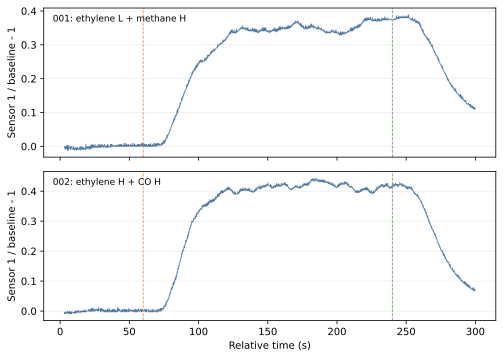
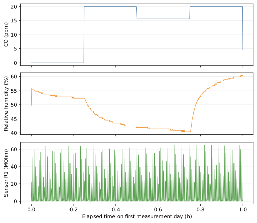

# 阶段 3：UCI 309／487 数据理解与 EDA 报告

检查日期：2026-09-24。**仅为探索性数据分析（diagnostic_only），不是模型验证或焦化厂实测。**原始数据分别来自 [UCI 309](https://archive.ics.uci.edu/dataset/309/gas+sensor+array+exposed+to+turbulent+gas+mixtures.) 与 [UCI 487](https://archive.ics.uci.edu/dataset/487/gas+sensor+array+temperature+modulation)。独立辅助实验不能与主实验按记录行或时间戳拼接。

## 文件、字段和可用参照

| 内容 | UCI 309：主实验 | UCI 487：独立辅助 |
| --- | --- | --- |
| 实验单位 | 180 次独立风洞实验；30 种气体释放组合各重复 6 次。ZIP 中有原始 180 个文件和降采样后的同组 180 个文件，**不是 360 次独立实验** | 13 个独立实验日，每日 100 段约 15 分钟的设置，10 个 CO 浓度档位各 10 次；约 1,300 个暴露段但只有 13 个实验日 |
| 字段与单位 | 相对时间 s、环境温度 °C、相对湿度 %、8 路传感器 ADC 读数；文件名含乙烯与甲烷／CO 的档位，**无每时刻准确浓度** | 相对时间 s、CO ppm、湿度 %、温度 °C、流量 mL/min、加热电压 V、14 路传感器电阻 MΩ |
| 标签来源 | 实验程序：60 s 开始释放、240 s 停止，观察到 300 s；这是**释放设置**，不是事故记录或实际到达传感器的瞬时浓度 | 文件有实验 CO 浓度 0–20 ppm；可分析浓度响应及湿度影响，不含事故／风险四级标签 |
| 实际读取量 | 原始共 3,451,372 行；降采样共 534,600 行（每文件 2,970 行） | 共 3,843,160 行，每天 295,391–295,881 行 |

两套数据均来自不同实验室设备及气流条件：309 仅有平均暴露浓度估计，CO 档位在百 ppm 量级；487 的 CO 设置为 0–20 ppm。不可将两者当作同一连续过程，也不可把浓度数值直接映射为共同的园区事故阈值。

## 数据质量与时间尺度

| 检查结果 | 数值与解释 |
| --- | --- |
| 缺失／非有限数 | 两数据集读取到的相关单元格均为 0；不等于“没有测量误差” |
| 309 时间轴 | 官方提供约 100 ms 降采样版本；所有 180 文件均有重复时间戳，共 **12,724** 次相邻相同时间。原始文件另有 **83,012** 次。各文件最长间隔可至 0.99 s，不应直接将时间戳设为唯一索引或无记录地删除重复行 |
| 309 时长 | 降采样文件最早记录时间 2.76–3.92 s，结束约 299.78–300.06 s；60 s 前基线每文件仍有 568–573 行 |
| 487 时间轴 | 实测各日中位间隔约 0.307–0.308 s；发现 **1 次时间回退**（2016-10-03）和 **1 处约 3.791 s 的最长间隔**（2016-10-11）；不能默认完全等间隔 |
| 487 边界样本 | 2016-10-13 起始有 **2 行温度低于 15°C**、**1,025 行湿度高于方案所设 75%**（但仍低于 100%）；所有日期共 **114 行流量为 0**，有可能涉及开始／结束阶段。其成因须分析，不能直接将整日删除或当成泄漏事件 |
| 常用变量范围 | 309：温度 20.01–22.48°C、湿度 35.48–45.41%；487：CO 0–20 ppm、湿度 16.34–83.81%、加热电压 0.198–0.9026 V |

## 响应、相关性和潜在混杂

1. 在 309 的 180 个降采样实验中，仅用第一路 ADC 读数作**诊断**：每次 120–230 s 暴露段中位数相对 20–55 s 背景中位数的变化，5%／50%／95% 分位数为 **3.54%／22.77%／38.68%**。该变量在部分实验中的相对变化较弱；这既不是检出率，也不是预警提前量。两次代表性实验在 60 s 程序开启后出现逐步上升，见下图；传感器反应会有时滞。
2. 同一路传感器在 309 释放前 10–30 s 与 35–55 s 之间的相对变化，中位数为 **0%**，5%／95% 分位数约 **−0.61%／0.58%**。这是固定比较窗的描述，不构成跨文件稳定性或低误报的证明。
3. 487 所有 13 日均能按说明中的 15 分钟安排得到 100 段，按各段 CO 中位数得到 10 个档位、各 10 次。首日诊断图显示 CO 档位与湿度同时变化，R1 还有明显周期响应。R1 与加热电压的**每日原始样本皮尔逊相关绝对值**为 **0.33–0.40**（仅描述相关，不推断因果）；R1 与 CO 的同期原始相关接近零也**不能推断 CO 不起作用**，因为有加热周期、响应时滞、湿度与分段设置的混杂。后续需在项目组确认后按独立日、暴露段及加热状态设计分析。
4. 309 的所有实验都在 60 s 开始释放，且没有“两气源始终不释放”的完整 300 s 阴性对照。即使把时间列从特征删掉，固定事件位置和实验中漂移也可能泄漏标签；未来评价应按**完整实验文件**分组，并把“程序开始”与“实际传感器响应／恢复”分开处理。

图 1　309 前两个按文件编号预先选取的不同气体组合示例；橙虚线为 60 s 程序开始、绿虚线为 240 s 程序停止。纵轴为单路 ADC 相对本次背景中位数的变化，**不是气体浓度**；不能据此估计全数据集检出准确率。

图 2　487 按最早实验日预先选取的前一小时示例；为提高可读性每隔 17 行取样绘制，统计结果仍用完整数据。R1 的周期变化须结合加热电压解释；图中 CO 是该实验的设定／测量浓度，不代表园区现场。

## 对研究问题的判断

- **309 支持**检验实验程序释放前后传感器的响应与释放后检测延迟，且要用完整实验划分，区分释放、背景、恢复。它不支持真实焦化园区事故准确率、四级事故标签或不依赖实验时钟的“事发前”预测结论。
- **487 支持**独立分析低浓度 CO 在不同湿度、加热周期和实验日下的观测条件；13 个实验日的跨日能力要如实报告，不能将近 400 万时间点当作数百万独立试验。
- **人员距离**目前没有现场或 D435 测量，今后若纳入，属于另行注明假设的仿真场景。两数据集没有同期人员位置，不能宣称实测多源联合准确率。

## 风险标签的下一阶段选择（仅提出，不执行）

| 选项 | 可验证部分 | 局限 | 判断 |
| --- | --- | --- | --- |
| A：实验事实与仿真风险分层 | 309 用程序释放状态、487 用 CO 实测／设置浓度做**各自**实验参照；空间距离与综合风险等级作为**单独仿真情境**设计 | 论文需清楚区分实测气体任务与仿真风险输出；分级阈值仍需依据及敏感性验证 | **推荐**：保留原申报书“多源＋分级”逻辑，同时避免制造事故真值 |
| B：先只研究实验气体事件 | 309 的释放响应问题最清晰，487 可做辅助分析 | 暂不能实证“人员接近—综合风险分级”，结题前须另外补充 | 更易完成，但与申报书主张的多源协同契合略弱 |
| C：直接将四级风险标签用于统一训练 | 可以形成单一输出表面 | 没有同现场风险真值，标签只能由人为规则生成；若拿作事故准确率会形成循环验证 | 不推荐作为主要实证路线 |

**建议进入阶段 4 时选择 A 的两层定义，但此时不规定等级数量、阈值或模型。**先查可引用的风险依据、模拟情境及标签效度，再提交详细候选方案。未经项目组决定不进入该阶段。

## 复现与边界

- 脚本：[scripts/eda_stage3.py](../scripts/eda_stage3.py)，运行示例：`python scripts/eda_stage3.py --uci309 uci_309_original.zip --uci487 uci_487_original.zip --out outputs/eda_stage3`。依赖为 Python 3.12.14、NumPy 2.3.5、pandas 2.2.3、matplotlib 3.10.8；运行时的脚本与源 ZIP 哈希写入 [摘要 JSON](../results/eda_stage3/summary.json)。脚本完整读取文件并逐次／逐日汇总，不输出原始数据。清单见 [309 每实验](../results/eda_stage3/uci309_file_inventory.csv)和 [487 每日](../results/eda_stage3/uci487_day_inventory.csv)。
- 图均由源文件直接绘制，标记为探索性，600 DPI PNG 与 SVG 同时导出；正式论文图需等结果验证和目标版式尺寸检查。309／487 取图规则固定为文件编号 001、002 和时间最早一天，不作为随机代表性样本。
- 数据出处及署名按上述官方页面（CC BY 4.0）；源包 SHA-256 在摘要 JSON。未合并、未插补、未删除异常行，也未拟合机器学习模型。

## 【需要人类决策】

阶段 4 是否采用**A：实测气体实验标签与仿真综合风险等级分层定义**？如果选择 B 或另有路线，需先说明如何处置原申报书的多源风险分级目标。
