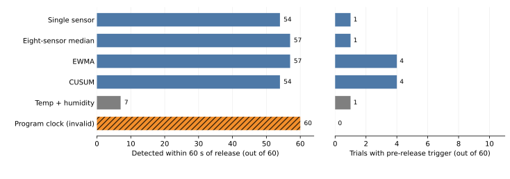

# 阶段 5：UCI 309 气体变化检测实验结果（仅限实验室条件）

日期：2026-09-24。项目组已批准 [A 主实验、B 基线敏感性实验与结论边界](stage5-m1-experiment-protocol-proposal.md)。本报告针对真实公开的 UCI 309 **风洞气体传感器实验**；只有“气体通道冻结”一项是**合成负控**，时钟规则仅用于揭示标签捷径。未训练四级事故分类器，没有焦化厂或 D435、Jetson 实验。

## 运行与数据划分

- 官方数据：[UCI Gas sensor array exposed to turbulent gas mixtures](https://archive.ics.uci.edu/dataset/309/gas+sensor+array+exposed+to+turbulent+gas+mixtures.)，下载 ZIP SHA-256：`5e9b707e7a44b3dcaf39b62bb46597403fcdd98ec89814b15e4876694db5f41e`。采用配套的 180 个降采样实验文件，原始版本不另当独立样本。每配置 6 次，固定随机种子 `20260924`，按完整文件得到训练 90／验证 30／测试 60；[逐文件切分表](../results/m1_uci309/split_manifest.csv)。所有阈值及 B0 通道选择根据训练／验证确定，留出文件没有用于阈值／通道选择。
- 每个秒窗 `[n,n+1)` 对重复时间戳处的样本取中位数，在 `n+1` 秒末才输出。A：每实验 `[5,25)` s 已知清洁段定本次中心；B：训练实验统一中心，测试不使用本次清洁段。训练段 25–60 s 用于阈值候选，验证段从这些候选中选择；每种模型统一执行 **3 个有效秒窗连续证据**。检测器运行从 25 s 开始且**不**在 60 s 重置。离线评分才用程序释放开始 60 s／停止 240 s；输出时刻 60 s 对应释放**之前**结束的最后一个秒窗。若短时证据在 60 s 前已开始，只是在 60 s 后才凑足持续条件，则记“释放前起源”，**不算**由释放引起的检出。
- 开发集预先按“验证集释放前虚警文件数≤1，先减少虚警，再增加 60 s 内检出、总检出，再降低漏检计 180 s 的延迟惩罚”选候选；对训练背景分数给出 0.95、0.99、0.995、0.999 四个分位候选。B0 在验证集从 8 通道选 1 路，B1 是 8 通道标准化响应绝对值的中位数。M1a 为该分数 EWMA（系数 0.3）；M1b 为同一分数的单侧 CUSUM。**每种方法单独定训练参数，测试不选赢家。**详见[计算代码](../scripts/run_m1_uci309.py)及[验证候选与最终选择表](../results/m1_uci309/selection_validation.csv)。
- 测试集释放前总观察仅 `60×35=2100 s`，也就是分散在 60 段中的 **35 min**；以下误触发数**不是**工业现场全天误报率。气源程序开始不是传感器收到气体的实际时刻，所有“延迟”只相对程序开始。无完整持续阴性运行。

**结果性质与复核记录：**第一次试运行后，检查持续时间 5 s 的灵敏度时发现有一段 G1 在释放前开始、G2 却在释放后完成。我们修正了所有方法的离线评分器，加入“释放前起源”单列并重跑**同一批 60 个留出文件**，当前结果版本为 `m1-uci309-20260924-v2`。因此这些文件已经被查看和重复评价：它们是**探索性方法试运行结果，不是只使用一次的最终封存盲测**。没有用测试成绩重新挑选阈值或通道，但评分规则的更正会使验证集上的某些方法重新选中候选阈值。将来若要正式检验泛化，应获取新的独立实验数据，不从本数据重新随机切一批并冒充外部验证。

## 测试集主结果

| 条件与方法 | 释放期间检出／60 | 程序开始后 60 s 内检出／60 | 释放前触发文件／60 | 已检出实验的延迟中位数（s） |
| --- | ---: | ---: | ---: | ---: |
| A／单通道静态阈值 B0 | 58 | 54 | 1 | 25 |
| **A／8 通道中位汇总 B1** | **59** | **57** | **1** | **24** |
| A／EWMA M1a | 59 | 57 | 4 | 23 |
| A／CUSUM M1b | 54 | 54 | 4 | 25 |
| B／单通道静态阈值 B0 | 56 | 54 | 0 | 30 |
| B／8 通道中位汇总 B1 | 48 | 46 | 2 | 33 |
| B／EWMA M1a | 48 | 47 | 2 | 34.5 |
| B／CUSUM M1b | 49 | 45 | 5 | 46 |

上述四种方法的 G2 均按 3 s 连续条件统计。A/B 对照分别在训练／验证中定参数，不能解释为仅改变了一个参数的因果消融。在完全相同的 60 个测试文件上，A 的 B1 比 B0 多 3 个“60 s 内检出”、没有减少释放前触发文件；比 EWMA 同为 57 个早期检出，但释放前触发文件数为 1 对 4。**这些差异不足以证明复杂模型普遍优越，当前数据更支持保留简单的多通道基线。** B1 从 A 的 57 降至 B 的 46 个 60 s 内检出，反映对实验已知清洁起点和校准方式的依赖。



图 1　仅 UCI 309 风洞实验；前四行为 A 下真实气体通道，第五行为**真实温湿度负控**，最末“程序时钟”是明知释放时刻的**无效伪模型**，不得视为可部署模型。左侧分母是 60 次完整测试实验、右侧分母同为 60 次；每次释放前实际监测 35 s。图由[独立绘图脚本](../scripts/plot_m1_uci309.py)仅读取[正式汇总](../results/m1_uci309/summary.csv)生成，同时保存了 [600 DPI PNG](../figures/m1_uci309/m1_test_comparison.png)。

## 负控、敏感性与重要反例

1. A 下**只用真实温湿度**、同样按验证集选阈值：中位汇总在测试集中 19／60 释放期间检出、7／60 在 60 s 内检出、1／60 释放前触发；环境 CUSUM 可在更迟的时刻检出 43／60，但只有 17／60 在 60 s 内检出。这个对照提示八路气体传感器的早期读数提供了额外信息，**仍不能排除同一设备在固定时间随运行进度漂移**。
2. 将测试气体读数**合成为固定背景**（没有真实气源变化）并使用事先选好的原阈值时，所有 A/B 气体方法都 0／60 触发。这是**合成消融的实现检查**，不是 60 次新的真实无释放实验，也不能证明长期低虚警。
3. **程序时钟伪模型**使用已知 `60<=t<240`，对程序标签可有 60／60 检出、0 s 理想延迟、0 次释放前触发。它表明即使主表数字很漂亮，单靠同一个固定释放时刻的数据也不能辨别“气体信息”与全部时间捷径；本研究限制输入并做负控，只能缓和风险，不能消除这一不可辨识性。
4. 按此前批准的 1／3／5 s 做**探索性持续时间敏感性**，保持参数和阈值不变。A 的 B1 分别在 60 s 内检出 57／57／57 个、释放前触发 1／1／0 个，已检出延迟中位数 22／24／26 s。5 s 时有 1 次在 60 s 后才形成的 G2，**其 G1 实际始于释放前**；评分器将其单列为“释放前起源”，没有充作释放后的新检出。5 s 未经验证集重新选择，本次不把它改为新默认。[完整敏感性表](../results/m1_uci309/duration_sensitivity.csv)。
5. 文件级结果中 A 的 B1 有 1 次未检出（`011_Et_n_Me_L`）；A 的 EWMA 有 1 次因释放前先触发而未记为释放后新检出；A 的 CUSUM 还有 2 次“释放前起源”事件。所有模型失检和既有报警都保留在[逐文件结果](../results/m1_uci309/file_results.csv)，没有在 60 s 重新置零来提高成绩。质量检查发现本次测试监测区间无无效秒窗；这不意味着真实部署不会缺测。

## 结论和边界

本轮探索性结果**支持进一步研究 B1 作为候选气体证据模块**：它在本数据的已知清洁启动、配置已见过的留出实验中，用简单多通道汇总取得有记录的误触发／延迟权衡。不能写成“山西焦化厂气体事故预警准确率 98.3%”“提前 24 s 预测事故”或“Jetson、D435 已验证”。**相对程序开始的延迟是正值，中位 24 s；本实验没有事故前真值。**

该数据仍存在不可解除的固定释放时钟及没有长时纯阴性对照两项局限。为了给最终论文提供更可辩护的外部证据，下一节点建议：先单独完成 UCI 487 的低浓度 CO／湿度／加热周期跨日辅助分析，或另外寻找**可变释放时刻加长时阴性**的真实实验数据；之后再决定仿真人员位置与 S1 处置矩阵的具体演示范围。487 与 309 不能拼接成同一现场轨迹。

## 复现

```bash
python -m unittest discover -s tests -p 'test_m1_uci309.py' -v
python scripts/run_m1_uci309.py --archive ../uci_309_original.zip --out results/m1_uci309
python scripts/plot_m1_uci309.py --results results/m1_uci309 --out figures/m1_uci309
```

运行记录、阈值及环境版本：[run.json](../results/m1_uci309/run.json)、[运行登记](../registries/run_record.csv)、[结果登记](../registries/result_registry.csv)。正式数据表和图表只来自程序，不由报告人工重新生成数值。

## 【需要人类决策】

**选择后续侧重：A（推荐）先完成 UCI 487 的独立跨日 CO 辅助分析，再设计 S1 人员轨迹仿真；B 先补找可变释放时刻／持续阴性的真实数据，进一步核验 309 的时钟局限；C 在现有实测限制下直接进入 S1 仿真，但论文只作方法演示。**目前不启动 487 建模或生成人员轨迹，等待项目组选择。
