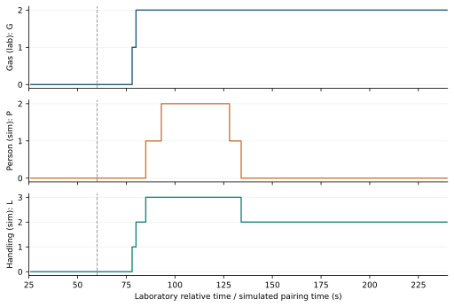
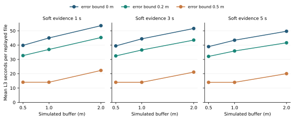

# 阶段 6：309 实验室气体重放＋模拟人员轨迹的探索性结果

记录日期：2026-09-25（北京时间）。项目组选择[阶段 6 方案 A](stage6-s1-scenario-design-options.md)后，先在主实验执行前单独[冻结场景配置](../configs/stage6_s1_fixed_a.json)：GitHub 首次独立提交 `5f9d1716fffce67ae7b83c3f7d91128f7fb19254`、配置 SHA-256 `f43a465afd48861643588691a86dc47504341844ddd074ffa7d9277e4b5b532e`。下面的所有人坐标、区域、时钟配对、掉线、定位误差与处置等级是**研究者仿真**；气体读数才来自[UCI 309 风洞实验](https://archive.ics.uci.edu/dataset/309/gas+sensor+array+exposed+to+turbulent+gas+mixtures.)。UCI 487 的独立气室 CO 校准没有混入时间轴。

## 固定协议与证据检查

- 原 UCI 309 ZIP SHA-256：`5e9b707e7a44b3dcaf39b62bb46597403fcdd98ec89814b15e4876694db5f41e`；沿用 M1 已保存的 **A／8 通道中位 B1** 阈值 `6.292830163226808` 和原文件级 90／30／60 切分。用每个实验已知清洁启动段 `[5,25)` s 校准，不用实验释放时刻作为输入，气体每个 `[n,n+1)` s 窗口完成后才输出。重新跑完 **全部 60 个原留出实验文件**，逐文件同原 M1 探索性试验的检出／误触发／首次触发结果核对一致；对原已查看、修订评分的测试文件**不声称新的盲测**。
- 只研究完成秒窗时刻 **26–240 s**；官方原实验有 240–300 s 恢复段，原 M1 程序未包含，故不报告恢复期性能。0–60 s 中可用于当前监测的只有 26–60 s；没有长时间、整文件从未释放的实验阴性对照。60 s 是实验气源启动参照，绝不是现场事故时刻。
- 统一模拟矩形控制区 `[0,2]×[0,2]` m，轨迹在 `y=1` 的地面平面运动。典型三类预设路径：一直在区外、在气源启动前穿越、在约 80–140 s 靠近并穿越。全部 60 个气体文件共享**同一套路径**，不按每条曲线的 G2 时刻选择相遇时刻。模拟缓冲基准 1 m；气体证据持续 3 s。气体的 `coverage_zone_id=zone_A` **只是假定覆盖区域**，风洞没有人的真实位置或焦化园区气云空间真值。
- S1 矩阵输入是 G0/G1/G2 与 P0/P1/P2；位置由二维有符号距离和定位误差界判定。错区、位置未知、气体缺秒或过期时，**不查询联合矩阵**，单路已知事件仍保留各自最低处置优先级。四状态是模拟处置等级，不是事故真值、人员毒气暴露水平或法规报警档位。

## 八种固定情境的计算结果

以下“出现 L3 的文件数”只是**对人为时间安排的情境覆盖**；每一行重用了同样的 60 条真实气体实验，绝非 480 次独立事故、融合准确率或提前预警成功率。L3 秒数是 60 次重复重放的**累计模拟秒数**，没有用它估计真实现场发生率。

| 情境 | 60 条中的 L3 文件数 | 累计模拟 L3 秒 | 联合不可判定的模拟秒 | 可直接审查的现象 |
| --- | ---: | ---: | ---: | --- |
| S0 人员一直在模拟区外 | 0 | 0 | 0 | 气体 G2 单独仍保留至少 L2 |
| S1 人员仅在释放前短背景期穿越 | 0 | 0 | 0 | 人员 P2 独立保留 L2；不会把后来气体证据倒贴到过去 |
| **S2 预设时间可能重叠** | **58** | **2,664** | **0** | 同时 G2＋P1/P2 时升 L3，取决于人为设置的接近时间 |
| S3 早期人员穿越、后期才有气体证据 | 0 | 0 | 0 | 两件事先后发生，不等于同期联动 |
| S4 气体缺测（100–109 s） | 58 | 1,997 | 600 | 缺秒中断三秒连续证据，恢复后需重新积累；人员事件保留 |
| S4 人员位置缺测（100–109 s） | 58 | 2,111 | 600 | 无法联合判断，气体 G2 单路保留 |
| S4 人员归属错误区域（100–109 s） | 58 | 2,111 | 600 | 不跨区产生联合 L3，两路单独记录 |
| S4 气体结果超出 1 s 新鲜度（100–109 s） | 58 | 2,111 | 600 | 不把陈旧证据当同一时刻联合输入 |

每种 10 秒 S4 故障注入×60 次重放，产生 **600 个不可联合判断的模拟秒**；这是**配置长度乘实验文件数**，不是从真实设备故障统计得到。S2 中两个没有 L3 的文件是 `011_Et_n_Me_L`（原模型无释放期间检出）和 `091_Et_n_Me_H`（气体持续证据与此轨迹的靠近时段没有重叠）。没有删除这两个不符合演示目标的文件。S2 首次联合 L3 在 58 个发生的文件中为 **85–125 s**；全部在程序开始 **60 s 之后**。S1／S3 无 L3 也不证明真实环境“绝无误报警”，因为释放前观察很短，而且 M1 原实验有 1 个释放前触发文件。



图 1　文件 ID 按字典序预选为 `002_Et_H_CO_H`；上层 G 来自风洞实验室读数，中层 P 是自定义的模拟路径，下层 L 是矩阵输出。虚线为已知**实验程序**的 60 s 气源启动，仅供离线说明；图示并非现实焦化园区同步采集。逐秒字段另见[示例时间线](../results/stage6_s1_a/illustrative_timeline.csv)；其中 `011_Et_n_Me_L` 是已知未检出文件，明确作为**事后反例**展示，不作为预先挑选的成功样本。

## 先前批准的 27 组敏感性

对相同 S2 轨迹／60 个气体文件，固定原阈值，仅交叉改变缓冲宽度 `0.5/1/2 m`、模拟定位误差界 `0/0.2/0.5 m`、G2 连续条件 `1/3/5 s`；使用同一组随机位移方向和长度比例，从未按测试结果重选阈值。误差界是**人为构造的最大地面位移假设**，不是 RealSense D435 实测定位精度。输出点到区边界的距离区间若跨越 P0/P1/P2 分界，就标记“位置不确定”而非强行给 P0。

| S2 设置 | 出现 L3 的文件数／60 | 累计模拟 L3 秒／60 个重放 | 位置不确定的模拟秒／60 个重放 |
| --- | ---: | ---: | ---: |
| 1 m 缓冲、0 m 扰动、3 s 持续（基准） | 58 | 2,664 | 0 |
| 1 m 缓冲、0.2 m 扰动、3 s 持续 | 58 | 2,196 | 600 |
| 1 m 缓冲、0.5 m 扰动、3 s 持续 | 57 | 842 | 2,460 |
| 0.5 m 缓冲、0 m 扰动、3 s 持续 | 58 | 2,367 | 0 |
| 2 m 缓冲、0 m 扰动、3 s 持续 | 58 | 3,097 | 0 |
| 1 m 缓冲、0 m 扰动、1／5 s 持续 | 均为 58 | 2,701／2,606 | 均为 0 |

定位误差界 0.5 m 时，基准 1 m 缓冲的 **2,460／12,900** 个时钟位置是“不确定”；由于位置轨迹和误差向量在 60 条气体文件上完全相同，实质上是同一虚拟轨迹的 **41／215 个秒窗**重复 60 次，不能把 2,460 当独立测量。敏感性主要揭示**模拟空间假设影响 L3 持续时间**，并不估计真实系统的定位鲁棒性或误报率。[全 27 组表](../results/stage6_s1_a/sensitivity_aggregate.csv)、[逐气体实验表](../results/stage6_s1_a/sensitivity_by_trial.csv)。



图 2　纵轴为每条被重放的风洞实验**平均模拟 L3 秒数**，不是事故率。曲线由[独立绘图脚本](../scripts/plot_stage6_s1_a.py)只读取正式结果生成；SVG 与 600 DPI PNG 已检查可读性、图例和裁切。

## 能得出的结论、停止条件与下一步

这项结果**证明脚本按预先选定的模拟规则运行**，能保留单路越界／气体异常、拒绝错误区域配对，并展示空间阈值与缺测对处置输出的影响。它没有真实人员位置、气体在空间的覆盖真值、真实联合安全后果或独立事故分级标签；S1 矩阵输出不能充当自身的“预测准确率”真值。原 309 测试文件早已查看且释放时刻固定，本结果仍是探索性方法演示。**不能写“对焦化园区提前预警 58／60”或“真实多源融合提高事故识别率”。**

原始数据不入库。[冻结配置](../configs/stage6_s1_fixed_a.json)、[重放脚本](../scripts/run_stage6_s1_a.py)、[验证性质的测试](../tests/test_stage6_s1_a.py)、[运行与来源哈希](../results/stage6_s1_a/run.json)、[完整场景逐文件表](../results/stage6_s1_a/trial_scenario_summary.csv)可以复现结论。命令：

```bash
python scripts/download_data.py 309
python -m unittest discover -s tests -p 'test_stage6_s1_a.py' -v
python scripts/run_stage6_s1_a.py --archive data/raw/uci_309_original.zip --config configs/stage6_s1_fixed_a.json --out results/stage6_s1_a
python scripts/plot_stage6_s1_a.py --input results/stage6_s1_a --out figures/stage6_s1_a
```

**申报书提醒：**烟雾遮挡、液体泄漏／积液、车辆违规、人员操作违规和粉尘仍未验证；D435／Jetson／现场传感器没有被使用。论文若坚持更强的“智能提前预警”主张，需要可变释放时刻、足够长的无释放运行或新的同场人员＋气体资料；目前只有方法级仿真与拟部署系统设计。参见[承诺清单](commitments.md)。

## 【需要人类决策】

下一阶段优先选 **E1（推荐：调查新的真实气体数据，寻找可变释放起点与足够的无释放对照；若找不到，则限缩论文主张）**，还是 **E2（用现有 309＋487 在既定局限下完善基线、鲁棒性和系统拟部署论证）**？不应重复随机划分 309 并称其为新的外部验证。
