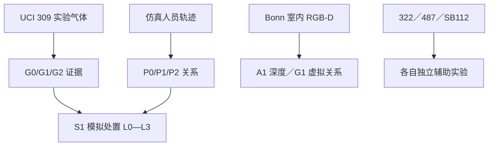

# 阶段 8 / N1：系统接口与论文证据对照

日期：2026-09-25（北京时间）。项目组已选择 **N1：固定现有视觉接口，整理整体系统与可用证据**。本报告是架构与已有实验的核对，**未开展新的多源同步实验、未启动论文全文写作，也未使用 D435、Jetson 或现场传感器**。审计索引见[阶段 8 结果索引](../results/stage8_n1_evidence_index.json)，申报目标的持续记录见[承诺清单](commitments.md)。

## 1. 研究结果由三条不同证据线组成

| 来源／现有输出 | 已经验证的具体问题 | 数据本质与时间尺度 | 可用于论文的结论边界 |
| --- | --- | --- | --- |
| [UCI 309：M1](stage5-m1-pilot-results.md)和[阶段 6](stage6-s1-fixed-replay-results.md) | 8 路风洞传感器的实验室气源变化检出；固定人员轨迹重放中的缺测、错区、持续条件及 L0—L3 模拟处置 | 同一数据集的 180 个实验文件；M1 留出 60 文件**已因评分修正重复使用**；阶段 6 复用该 60 文件并人为设定人员轨迹和同钟配对 | 主线是**实验室气体异常证据＋仿真人员区域状态的可审计规则**；58/60 个文件出现模拟 L3 只表示指定轨迹覆盖，不是 58 次事故预警成功 |
| [UCI 322 阶段 7A／7B](stage7-b-posthoc-diagnostic-results.md)、[SB112](stage7-a-separate-validation-results.md)、[UCI 487](stage5-uci487-v3-results.md) | 322 两套气室的多通道变化报警及仅乙烯干扰；SB112 另一设备无人工刺激日的背景事件；487 已完成 CO 暴露段的校准 | 互不相同的仪器、地点、时钟、标签、采样程序；487 的结果用暴露**末段**数据，322 同一气室运行内部有重复程序 | 322 B1 是**泛气体响应变化**而非 CO／甲烷专一识别；487 不是实时早期预警；SB112 烟雾传感器背景事件不是视频烟雾遮挡检测，也不是已核实事故误报 |
| [Bonn RGB-D 室内二维框](stage8-v1a-a2-2d-detector-results.md)与[A1＋G1 深度区域复核](stage8-v1a-a2-repeat-depth-results.md) | 115 张抽样室内帧的人员二维框，以及按冻结规则输出躯干深度 `valid/unknown` 和相机相对虚拟区域状态 | 两段相似室内序列；24 张独立复标；第二条录像标注时已见，A1/G1 在第一条开发序列确认后才复核第二条深度 | 在 34 个人工有人帧中，第二条有 32 个自动框可输出深度，2 个二维漏检为未知；没有独立人体测距真值和实际禁区标签，不能写为 D435 或焦化现场越界准确率 |

**没有任何一条数据同时记录同地点的真实气体状态、真实人员三维位置和真实处置结果。**因此论文可以分别报告气体变化检测、室内视觉接口、受控仿真处置；不得把 UCI 309／322／487、SB112、Bonn 的时间戳拼成所谓焦化厂同步多源样本，也不能对自主定义的 L0—L3 标签计算“事故四级准确率”。

### 目前实际跑通的关系

图中的两条空间路径**没有进入同一次 S1 重放**。S1 的 `P0/P1/P2` 来自地面平面上预设矩形区 `[0,2]×[0,2] m` 和 1 m 仿真缓冲；G1 的 `outside/near/inside` 来自 Bonn 室内相机坐标的躯干中心横坐标 `X` 及 0.15／0.35 m 虚拟边界。数值上虽然均有三档，几何、参考系、位置误差和时间轴都不同，**不能简单把 G1 重命名为 P 并声称得到真实视觉＋气体融合实验**。

## 2. 系统拟部署架构：模块职责与接入条件

| 层和拟用设备 | 设想的输入／输出 | 当前实证状态 | 真正落地前必须补的条件 |
| --- | --- | --- | --- |
| 现场气体端：CO、可燃气传感器；视需要加温湿度 | 每通道值或响应、**单位和校准方式**、设备 ID、测量时刻、质量状态、所属覆盖区；不把 MOX ADC 直接称为 ppm | 仅公开实验室数据；309、322、487 都不能代表同一套现场仪表 | 测量对象和实际标定、安装区域、现场对照数据与独立验证；现有气体模型阈值不得跨装置沿用 |
| 人员视觉端：拟用 D435 或经后续选型的 RGB-D 感知设备 | RGB、配准深度、相机标定、二维框／质量标志；深度不足输出 `unknown`，位置须注明相机坐标系 | 实际只在**波恩大学设备采集的室内数据**运行通用二维检测器和 A1/G1；没有 D435 采集 | 真实设备测试、外参、地面与危险区几何、人员身体范围、遮挡和定位误差；相机近／远和区域内／外不等于人员实际暴露 |
| 边缘分析端：拟用 Jetson Orin Nano | 按传感器时间和覆盖区组织证据，执行气体与视觉模型、质量门控、处置规则并写事件日志 | 原项目脚本只在 PC／通用 CPU 离线运行；已有 53.298 ms 是二维模型预处理＋CPU 推理中位数，**不是端到端或 Jetson 实测** | 设备可用后独立测吞吐、端到端时延、资源、丢帧与故障恢复，按具体系统重新评估实时性 |
| 决策与输出层 | 单路异常先保留；仅在时钟和区域均可对应且状态有效时交叉判读；缺测不自动降为正常；输出研究内处置状态、原因与人工复核信息 | S1 对**模拟**错区、掉线、证据过期已有规则重放；未与 Bonn 人员视频或真正现场气体数据同期测试 | 企业实际区域映射、风险等级与动作需另行定义和验证；自主定义 L0—L3 不是法规等级或事故后果标签 |

**接口约束（设计建议，尚未实现现场总线或网络接口）：**每条证据最少记录 `source_id`、`dataset_or_site_id`、原始测量时刻及其时钟系、`zone_id` 和映射方法、`coordinate_frame`、数值与单位、`quality`／缺测原因、算法及配置版本。另标注 `evidence_origin ∈ {public_lab, public_indoor, simulated, prospective_field}`；离线把两种来源接到同一演示时，生成的同步时钟须注明 `simulated_pairing`。`no_detected_person` 只能表示本帧未见检测框，不等于确认没有人；视觉 `unknown` 或气体 `unknown` 均不得默默填成低风险。没有已知共同覆盖区和可验证时间关系，联合状态须保留不可判定及已有单路事件。

### 拟部署时的数据关系与当前可说的程度

| 申报书环节 | 可以交付的当前证据 | 不能越过的表述边界 |
| --- | --- | --- |
| 单点异常识别 | UCI 309／322 实验室变化检出，Bonn 室内二维人员框与深度可用性；487 独立校准；SB112 背景日报警 | 尚无焦化厂 CO／甲烷泄漏浓度真值、真实人员越界标注或现场多路仪表长时间运行 |
| 多源交叉验证和时空关联 | S1 在**人为设定覆盖区、时钟与人员轨迹**的条件下能处理错区、缺测和证据过期 | 没有 UCI 气体与 Bonn 视觉同期数据；两种空间定义不兼容；不得说已实测验证“视觉确认气体泄漏” |
| 动态风险／分级输出 | 模拟处置矩阵对气体持续性和人员关系给 L0—L3，参数敏感性已经报告 | 等级由研究者规则给出而非事故真值；没有事故前预测、提前量、预测正确率 |
| 设备与系统 | D435／环境传感器作为**拟部署感知端**，Jetson 作为**拟部署计算端**；可说明预期输入与软件职责 | 未购装、采集、部署或测功耗；不能写“本研究基于 D435 实测”或“Jetson 满足实时性” |

## 3. 中期／结题必须说明的申报书差异

已完成的是**公开数据上的局部算法实验、明确标注的场景仿真和拟部署软件架构**。原书中烟雾遮挡**视觉检测**、液体泄漏与积液识别、车辆违规、人员操作违规、粉尘与液位传感、热力图叠加、D435/Jetson 实物集成均未完成；SB112 的烟雾**传感器读数**不能冲抵视频遮挡模型。真实多源同期融合、三维人体距离准确率、焦化厂现场预警效果和论文投稿／发表也尚无证据。项目组已明确不做完整实体样机，正式申报书仍写了设备选用并接入和多类场景模型，项目范围变化应与指导教师及校方按项目管理流程对照说明。

## 4. 论文可引用的主张与下一决策

**建议将主张写为：**“针对焦化园区拟部署场景，构建可审计的多源证据接口与分级处置规则，分别在实验室气体数据、公开室内 RGB-D 数据和明确标注的场景仿真中检查变化检出、空间状态可用性与规则行为。”这句话中的“分别”不可省；不能承诺现场预警优越性，也不在实验结果缺乏真值时添加‘事故预测’章节。

正式论文尚未开始。可先确定研究主张再设计提纲：引言与申报需求 → 证据来源／任务定义 → 气体实验与局限 → 室内 RGB-D 人员接口 → 仿真对时与处置规则 → 分离实验结果／反例 → 拟部署架构与未验证项。图表沿用[工作流约定](research-workflow.md)：实际输出和仿真图分开命名及图注，正文数字链接运行记录和[主张账本](../registries/claim_ledger.csv)；本页 Mermaid 是**架构沟通草图**，不作为论文定稿图号或性能图。

| 下一方向 | 论文主张与工作量 | 优点与风险 |
| --- | --- | --- |
| **T1（修订建议）：申报系统框架内的方法与分离验证** | 项目**仍用原申报书正式名称**。论文题目候选《面向焦化园区的多源感知与分级预警方法研究——分模块公开数据实验与场景仿真》；正文须有完整的**拟部署系统架构与申报目标对照**，分别报告实验室气体、室内 RGB-D、模拟处置，不把设备框架仅放在结尾讨论 | 与原申报书的“三维视觉感知＋多源环境信息融合＋智能预警分析”形成清楚的方法对应；要逐条披露设备未用、多个场景未做和无同期现场数据，不能保证原承诺全部完成 |
| T2：拟部署系统框架为主体 | 题目候选《面向焦化园区的多源感知安全预警系统框架与验证方法研究》；架构接口占更大篇幅，实验作为各模块实例 | 与申报书名称较接近，但读者容易把框架误读为已搭实物；没有现场或硬件实测时论文实证力度更弱 |

### 【需要人类决策】

下一阶段论文**主张范围**选 **T1（推荐）**，还是 **T2**？确定之后再拟论文提纲与图表清单；不先写整篇论文，也不把独立的气体、视觉、仿真数据拼成真实同期数据。

### 对项目组“选择 T1 是否无法交代申报书”的补充核对

T1 **不改变已提交的项目名称或立项目标**，而是在原申报书已经写明的“公开数据集与场景模拟数据验证”路径上，把实际论文的模型主张限定到已有证据。原书还承诺了完整智能感知系统、多种点位的视觉模型、D435 和 Jetson 硬件接入，因此 **T1 不能自动把这些承诺变成已完成项**；能否以范围调整的成果结题，还需由项目组与指导教师及学校按实际要求核对。项目报告和论文应分别对下面四项作明示：

| 原申报书的骨架 | T1 论文和项目报告中的具体落点 | 真实完成程度 |
| --- | --- | --- |
| “三维视觉感知＋多源环境信息融合＋智能预警分析” | 方法章节给出未来感知端、边缘端、对时／质量门控和分级输出的完整框架；RGB-D 室内子实验独立呈现二维检测、躯干深度和相机相对虚拟区域；气体模块分别报告公开实验 | 方法框架与局部算法证据已具备；没有同址同钟的现场多模态实验，也没有真实人体三维距离真值 |
| “单点异常→多源交叉验证→风险分级输出” | 309 等气体实验回答单点或多通道变化；S1 的**仿真**同钟、同区规则展示缺测和分级处置，保留单路事件；论文逐项标注哪些步骤是实验室证据、哪些是研究者假设 | 可验证规则行为，不能说实际焦化园区已实现跨源确认或事故四级预警准确率 |
| “D435＋Jetson＋气体／环境传感器” | 在**系统方案章节**说明 D435 拟提供 RGB-D、传感端拟提供带单位时间戳的环境输入、Jetson 拟执行推理与规则；列出实际接入后才可开展的性能测试 | 仅拟部署架构；实际用的是 Bonn 室内视频和 PC 计算，未采集 D435、未运行 Jetson、未接现场传感器 |
| “人员越界、烟雾遮挡、积液等模型；最终论文发表” | 明确室内**虚拟**人员区域接口是已验证的局部任务；视觉烟雾遮挡、积液、车辆等列入未完成目标及范围调整说明；论文撰写与发表独立记录 | 不能用烟雾**传感器**替代视觉烟雾模型，也不能把拟投稿写成已发表 |

**可用于项目进展说明的表述草案：**“项目沿原申报书的视觉感知、环境信息与分级预警总体框架，研究重点转向可复现的多源证据与处置方法。气体响应、室内 RGB-D 人员空间接口分别采用公开数据进行局部验证；跨源分级规则采用明确标注的模拟人员场景验证。D435、Jetson 及现场传感器现阶段保留为拟部署系统的设备映射；对未完成的烟雾遮挡、积液等子任务在中期与结题报告中逐项说明。”使用这段文字时仍须按当时实际进度更新，不把“拟部署”写成“建成”。

如果项目组希望论文对申报书的**硬件接入和各点位模型**作“已经完成”的结论，仅 T1 或 T2 的写法都无法填补实物、同期数据与实验的空缺，必须额外完成对应工作；选系统框架为标题并不会消除证据缺口。
