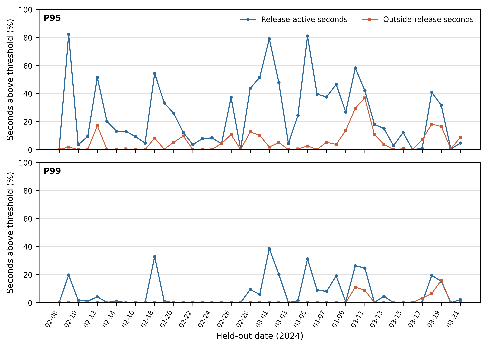
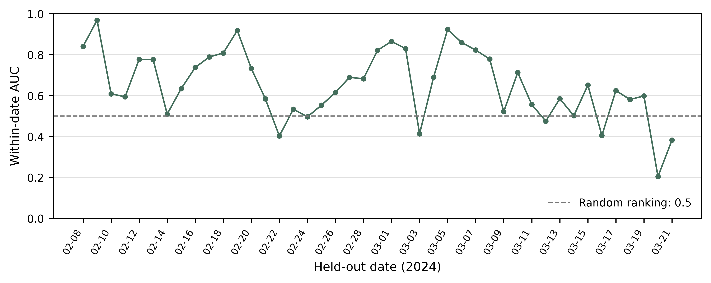

# METEC P1：按日期留一固定阈值辅助分析结果

运行日期：2026-09-27（北京时间）。项目组先批准P1，配置在出现本页结果前以提交 `aa4ce5a` 冻结；分析代码在运行前以提交 `2be529b` 固定。正式运行 ID 为 `stage9-metec-p1-20260927-v1`。原文件哈希、命令、环境和随机种子见 [`run.json`](../results/stage9_metec_p1/run.json)，汇总见 [`summary.json`](../results/stage9_metec_p1/summary.json)。

## 1. 结论

METEC 数据证明：在独立受控释放日志下，单点甲烷浓度整体具有一定区分信息，但跨日期稳定性不足，固定浓度阈值会漏掉多数释放观测片段。这个结果适合放在论文中解释“单一传感器固定阈值不足”和“需要环境上下文／质量门控”，不支持连续事件检出率、提前量或焦化园区现场性能。

主时区采用固定 MST（UTC−7）。43个合格日期的日期内浓度排序 AUC 中位数为 **0.634**，四分位区间为 **0.543–0.784**，对日期整组重采样得到的中位数95%区间为 **0.585–0.733**。7/43个日期的AUC低于0.5，日期范围为0.204–0.969，说明单点浓度与全场释放活动的关系强烈依赖日期和工况。

按其余日期的无记录释放观测拟合P95阈值后，留出日期中释放观测秒超阈值比例的中位数只有 **18.0%**，而无记录释放观测秒超阈值比例中位数为 **1.85%**。P99把后者的日期中位数降到0，但释放观测秒覆盖中位数也降到 **0.93%**；13/43个日期完全没有释放观测秒超过P99。提高阈值主要以严重漏检换取较少的背景触发。

## 2. 冻结协议与评价单位

- 每个整数秒取 `x_CH4_d_ppm` 中位数，共197,863个有观测的秒。
- 释放表的任一释放点活动即记为 `release_active=1`，713条释放记录合并为265个全场活动时段。
- 44个有观测日期中，43个同时满足至少30个释放秒和30个无记录释放秒；2024-03-22不满足条件，按协议排除。
- 每轮留出一个完整日期，P95/P99只由其他日期的无记录释放观测拟合。
- 日期是独立汇总和Bootstrap单位；秒只用于日期内部比例，不当作独立事故。

主表见 [`per_date_fixed_mst.csv`](../results/stage9_metec_p1/per_date_fixed_mst.csv)。43个留出日期合计包含120,832个释放观测秒和77,003个无记录释放观测秒；这仍是稀疏片段的计数，不是连续监测时长。

## 3. 主结果

| 指标（日期等权） | 中位数 | 四分位区间 | 日期Bootstrap中位数95%区间 |
| --- | ---: | ---: | ---: |
| 日期内浓度排序AUC | 0.634 | 0.543–0.784 | 0.585–0.733 |
| P95：释放秒超阈值比例 | 18.04% | 4.67%–41.44% | 9.46%–33.31% |
| P95：无记录释放秒超阈值比例 | 1.85% | 0.10%–9.25% | 0.33%–5.20% |
| P99：释放秒超阈值比例 | 0.93% | 0–9.11% | 0.05%–4.14% |
| P99：无记录释放秒超阈值比例 | 0 | 0–0 | 0–0 |

P95留一阈值的日期间范围为2.703–2.800 ppm，中位数2.759 ppm；P99范围为5.148–9.101 ppm，中位数8.690 ppm。虽然训练阈值变化不大，留出日覆盖比例波动仍很大。10/43个日期中，P95对无记录释放观测秒的超阈值比例超过10%；因此不能把跨日期中位数1.85%写成每个日期都低误触发，更不能换算成每小时误报。

图1　固定MST解释下的按日期留一阈值结果。阈值仅用其他日期的无记录释放观测拟合；折线连接只帮助查看日期变化。纵轴是稀疏观测秒比例，不是事件检出率或连续运行误报率。

图2　各留出日期内用干甲烷浓度区分释放活动状态的排序AUC。虚线0.5代表随机排序；日期差异明显，7个日期低于0.5。

## 4. 时区敏感性

发布页只写“Mountain Time”，原文件在2024-03-10仍存在当地夏令时规则下不应出现的02时记录。因此固定MST是主解释，`America/Denver`只作敏感性。

夏令时解释下，日期AUC中位数变为 **0.713**，P95释放覆盖中位数变为 **27.9%**，P99释放覆盖中位数变为 **5.17%**；逐日期表见 [`per_date_america_denver.csv`](../results/stage9_metec_p1/per_date_america_denver.csv)。一个小时的解释差异显著改变释放标签匹配和阈值分布，说明结果对时间基准敏感。除非数据发布者澄清时区，论文应报告两种结果并以固定MST为主，不能择优使用夏令时成绩。

## 5. 论文中的允许表述

建议正文写为：

> 在METEC受控释放辅助数据中，采用按日期留一的背景P95阈值后，释放活动观测秒超阈值比例的日期中位数为18.0%，日期内浓度排序AUC中位数为0.634；结果在日期间及两种合理时区解释间明显波动，表明缺少风向与连续背景条件时，单点固定浓度阈值不足以稳定表征场地释放状态。

不能改写为“甲烷泄漏检出率18.0%”“误报率1.85%”“模型准确率63.4%”或“可提前预警”。释放日志描述全场是否活动，单个测点不一定处于下风向；无记录释放秒也可能有残留甲烷和其他来源。本轮没有气象流、连续背景、人员信息或焦化事故标签。

## 6. 本轮没有执行的内容

没有训练逻辑回归、树模型或神经网络；没有根据结果重新选择阈值、删除低AUC日期或切换主时区；没有下载完整MGGA和6.34 GB气象文件；没有把METEC与Bonn同步拼接，也没有产生Jetson/D435实测数据。

## 7. 下一阶段建议

建议停止继续寻找或下载大体量甲烷数据，把P1作为论文中的独立受控释放辅助结果，更新正文证据表和论文提纲。下一阶段应回到论文整体：确定最终主张、表图位置及还必须补做的最小实验，而不是继续在METEC稀疏片段上开发模型。
